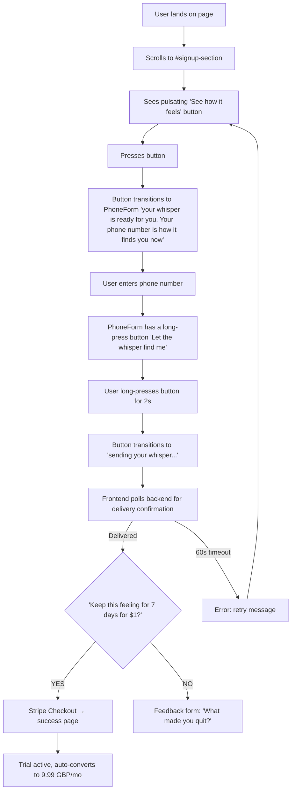
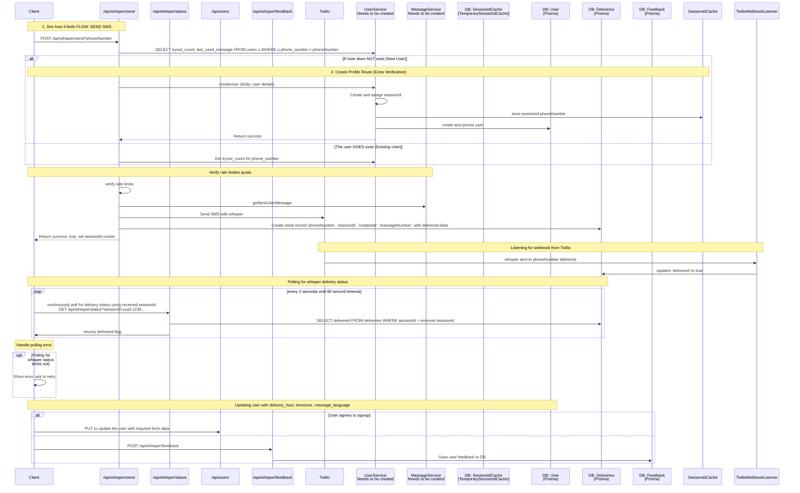

# THE NEW SIGNUP FLOW (ONE OPTION)

## REMOVE FREE TRIAL
First of all - the 7 day free trail. I'm not sure this is the right approach. I the customer is "sliding" through the funnel at breakneck speed, they might not even know what they are buying - other than a service that promises them to feel loved at the end of the day.

## PRICING SECTION
The pricing section - also according to the report - introduces substantial friction to the user, who after having acquiated themselves with some of the landing page, get a smack in the face to enrol in trial or buy the product outright.

## NEW FLOW

### Instead of the PRICING SECTION

1. Instead of the 3 pricing cards (trial, 30 days of messages, monthly sub), present a single, pulsating button centered on the entire screen saying "let the ritual start" or "see how it feels". 

2. Upon clicking it, show the user the usual OTP form but this time tell them "your whisper is ready for you. Your phone number is how it finds you now".

3. Instead of getting the OTP code, they will receive their first whisper. I'll make sure it's a good one (tactful, elegant, warm, inspiring trust and confidence)

4. The website will animate information about every stage up to delivering the whisper to the user

5. Beautiful animation

6. "Your whisper was just delivered. While you read it, would you like to keep this feeling every evening for the next 7 days for just $1?" 

7. There's two buttons 
    - YES - they get taken to the usual signup form which they got AFTER entering the OTP originally. The user and their phone number need to be known to the backend, which will create the checkout session for them.
    - NO - they get shown a single feeback form question "what made you quit?". This way I'll be getting additional feedback (hopefully). 
    
8. This time, the trial is going to be opt-out, transitioning into 9.99 GBP service. 

9. On day 6 & 7, the user will be notified the trial is about to end, and that they will be charged. The message will include a link to cancel.


# FACEBOOK PIXEL

`PageView` - NO CHANGE

`Contact` - The button that sends the user their first whisper

```diff
- StartTrial
```
`InitiateCheckout` - The button they press to get taken to the STRIPE checkout

`Purchase` - The success page after having subscribed to TRIAL - NO CHANGE

# FACEBOOK CAPI

`PageView` - NO CHANGE

`Contact` - backend receives the request to send whisper

```diff
- StartTrial
```
`InitiateCheckout` - **navigateToCheckout** receives the request to initiate

`Purchase` - Stripe webhook gets received for completed checkout

# NEW SIGNUP FLOW



# NEW SIGNUP OVERALL MECHANICS

```
IMPORTANT!!

Recommendation: Do NOT add motion/framer-motion. All animations described are achievable with CSS @keyframes + Tailwind utilities + light JS event handlers (onTouchStart, setTimeout). This guarantees universal mobile compatibility and zero bundle bloat.
```

- `<div id="pricing-section">` gets replaced with `<div id="signup-section">` & `#pricing-section` gets renamed to `#signup-section`
- `PricingSection.tsx` component DOES NOT get deleted. It needs to remain in place for `/ritual/<user_id>` route.
- `/ritual/<user_id>` route will be used for users who have already subscribed to free trial of the service
- `PricingSection.tsx` gets replaced by `SignUpSection.tsx` component
- `SignUpSection.tsx` is a whole viewport component
- `SignUpSection.tsx` is a parent + coordinator component. It conditionally renders subsequent elements. It holds all state required to complete the signup
- `SeeHowItFeels.tsx` is a big pulsating button - pulsating like a heart, rendered as child of `SignUpSection.tsx` - uses the `heartbeat` animation as defined in `tailwind.config.js`. 
- `SeeHowItFeels.tsx` has a text "see how it feels" that fades out as the user taps the button. When the user taps the button, they get shown the `PhoneNumberForm.tsx` component with new title ""your whisper is ready for you. Your phone number is how it finds you now"". They enter their phone number.
- `PhoneNumberForm.tsx` replicates `ConfirmationCodeForm.tsx` with `PhoneForm.tsx`. This is meant to ensure that `sessionId` is properly set for the user.
- `PhoneNumberForm.tsx` has a button "Let the whisper find me"
It needs to be "Hold to Confirm". Once the user holds the button for 2 seconds, it becomes a solid circle with the text "sending your whisper..." - it ripples like a heartbeat.
- `SeeHowItFeels.tsx` button keeps polling the backend api to check whether the message was delivered by the webhook handler. 
- **NOTE ON SERVERLESS ARCHITECTURE** - Webhook listener will be on a separate instance to the `SeeHowItFeels` button. They need to use objective USER ID to communicate. They will use the `sessionId`, because no DB USER ID will have been available at that point. The frontend will have to poll the backend on separate API. That's why the listener needs to persist the delivery status in the database. Use `sessionIdCache` to handle failures & retries.

Suggested logic:
1. The frontend sends POST /api/whisper/send?phoneNumber=+447... .
2. Serverless function triggers Twilio, creates a temporary record in Postgres DB (or Redis) linked to that `sessionId`, and returns a 200 OK.
3. Webhook listener receives the Twilio delivery receipt and updates the DB record matching the phone number. Use the `deliveries` table.
4. Frontend polls GET /api/whisper/status?sessionId=uuid-1234....

- `SeeHowItFeels.tsx` will timeout after 60 seconds and show an error message "We're having trouble delivering your whisper. We politely ask to retry in a moment."
- `handleNavigateToPricing` gets renamed to `handleNavigateToSignUp`
- Once the delivery gets confirmed, the button will fade out and be replaced by the Form asking the user to start the paid 1 USD trial.
- The `InitiateCheckout.tsx` component is a form. I has copy: "Your whisper was just delivered. While you read it, would you like to keep this feeling every evening for the next 7 days for just $1?"
- `InitiateCheckout.tsx` component has two buttons:
    - YES - they get taken to the usual signup form which they got AFTER entering the OTP originally. Just like in case of the regular signup flow implemented in `ContactForm.tsx`, the user need to get created in the DB first. The user and their phone number need to be known to the backend, which will create the checkout session for them.
    - NO - they get shown a single feeback form question "what made you quit?". (e.g., "Too expensive", "Didn't like the poem", "Just browsing"). This way I'll be getting additional feedback (hopefully). 


# SPECIFIC IMPLEMENTATION NOTES

## HOLD TO CONFIRM

The "hold for 2 seconds" interaction needs careful mobile handling:

- Must handle both `touchstart`/`touchend` AND `mousedown`/`mouseup`
- Must cancel on `touchmove` (in case user drags) and `touchcancel`
- Must `preventDefault()` on the touch events to avoid Safari's long-press context menu
- A `contextmenu` event listener returning `false` is also needed for Safari
- Haptic feedback via `navigator.vibrate()` is available on Android but NOT on iOS Safari — don't rely on it

## RATE LIMITING

- Instead of creating a new delivery table in the database to store amount of messages sent to a specific phone number as part of service tryout via "See how it feels" button, use the existing `users` table.
- Add columns `tryoutCount`, `tryoutLastSentAt`
- `tryoutCount` is the number of messages sent to a specific phone number as part of service tryout via "See how it feels" button
- `tryoutLastSentAt` is the timestamp of the last message sent to a specific phone number as part of service tryout via "See how it feels" button
- Rate limiting is per phone number which already exists on the `users` table
- Rate limiting allows 3 tryout messages per phone number IN TOTAL

## MESSAGE DELIVERY

- for keeping track of message delivery create a new `deliveries` table. It has columns: `phoneNumber`, `sessionId`, `createdAt`, `messageNumber`, `delivered` (Boolean flag)
- Each message is a separate row in the table
- For rate limiting, you count messages sent to a phone number
- For delivery, you check `delivered` status of the latest created message for a `sessionId`
- when creating the user in the `users` table, the `lastUsedMessage` needs to be same as the number of message sent with the latest tryout to that user's phone number

## API ENDPOINTS

- POST /api/whisper/send - sends a whisper to a phone number - replicates behaviour of the existing endpoint `/api/confirm/otp` but for the "See how it feels" flow - sends a whisper to a phone number. It uses `phoneNumber` from `deliveries` table to identify the message. It uses `tryoutCount` and `tryoutLastSentAt` from `users` table to rate limit the messages. It writes each request as a new row in the `deliveries` table. It returns `success` or `error`. This endpoint will take messages from the `messages` table and send them to the user. It will use the `lastUsedMessage` column from the `users` table to determine the next message to send. It will use the `tryoutCount` column from the `users` table to determine the next message to send.
- GET /api/whisper/status?sessionId=uuid-1234... - gets the status of a whisper. It returns Boolean flag for `delivered`.

## TWILIO WEBHOOK

- POST /api/whisper/webhook - receives webhook from Twilio with message status. It updates the `delivered` flag in the `deliveries` table.

## FEEDBACK FORM

- POST /api/whisper/feedback - receives feedback from user. It writes the feedback to the `feedback` table.
- `feedback` table has columns: `phoneNumber`, `sessionId`, `feedback`, `createdAt`
- valid `sessionId` needs to be provided to the POST /api/whisper/feedback endpoint to be accepted.
- `sessionId` is the same `sessionId` as the one used for the message delivery.

## STRIPE CHANGES

- This time, the trial is going to be opt-out, transitioning into 9.99 GBP monthly subscription
- the `api/checkout-sessions` route handler now looks at product type & `newSignUp` flag, and for subscription it will set a 7 day trial period
- need to use a new subscription product - but only for new signups. Product logic already implemented in the `src/app/api/checkout-sessions/route.ts` file.

## USER SERVICE
- encapsulates user creation, retrieval and udpate logic currently used by `api/users` route handler
- it will be called by the `api/whisper/send` route handler to create a new user
- it will be called by the `api/whisper/send` route handler to update the user record
- it will be called by the `api/whisper/send` route handler to get the user record - check whether user already exists

## MESSAGE SERVICE
- encapsulates message retrieval logic from `api/cron/distribute` route handler
- `api/cron/distribute` route handler should now use that service to retrieve messages for distribution
- it will be used as well by `api/whisper/send` to get the right message to the user
- it needs to include logic for updating the user record and increment sent message number


## SESSION ID flow for THE NEW SIGNUP




# TWILIO ADDITIONAL ERROR HANDLING

- potentially use the `https://lookups.twilio.com/v2/PhoneNumbers/<phone_number>`, and only once the phone number is confirmed as ok (`valid: true`), will the actual message created for delivery with Twilio

- 21211: Invalid 'To' Phone Number
- 21704: The Messaging Service contains no phone numbers
- 30034: US A2P 10DLC - Message from an Unregistered Number
- 30005: Unknown destination handset
- 35118: MessagingServiceSid is required to schedule a message

