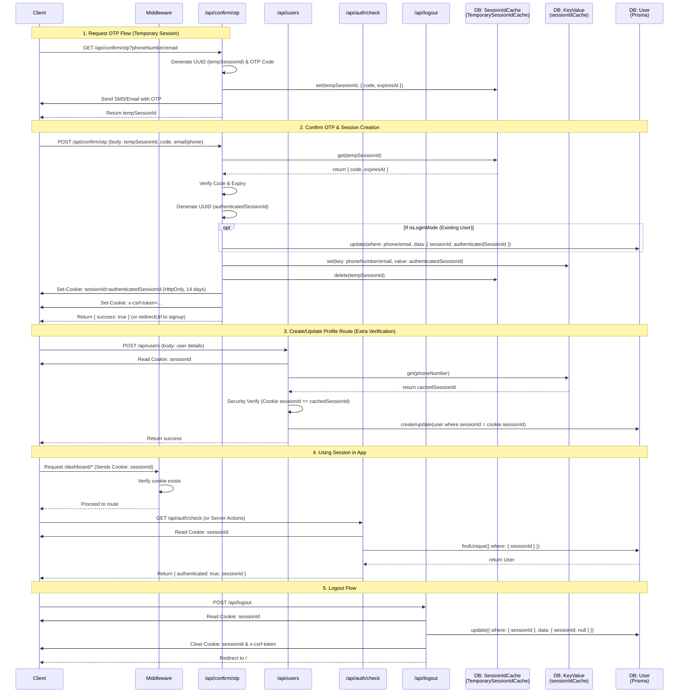

# Session ID Architecture Analysis

This document describes how `sessionId` gets created, saved to the database, cached, and used across components, routes, and middleware in the application.

## Session Types & Caching Breakdown
- **Temporary Session (`TemporarySessionIdCache` mapping to `SessionIdCache` DB Table)**: Created during OTP request, holds the OTP `confirmationCode` and expiry date. It acts as a bridge before a real user session is verified. Deleted once the code is successfully verified.
- **Authenticated Session Cookie**: Created securely as an HttpOnly cookie after OTP confirmation. It lasts 14 days and tracks the user across browser instances.
- **Verified Cached Session (`sessionIdCache` mapping to `KeyValue` DB Table)**: Stored as a secondary validation layer mapping a user's phone number or email to their current `sessionId`. Used heavily in `POST /api/users` as security verification to ensure the active session cookie matches the last generated session for that phone number.
- **User Record (`Prisma User Table`)**: Holds the `sessionId` directly on the `User` object. Route handlers (`GET /api/auth/check`, `PUT /api/users`) and server actions (`userIdFromCookie`) query this index to pull full user details based on the cookie. During logout, it is nulled out (`sessionId: null`).
